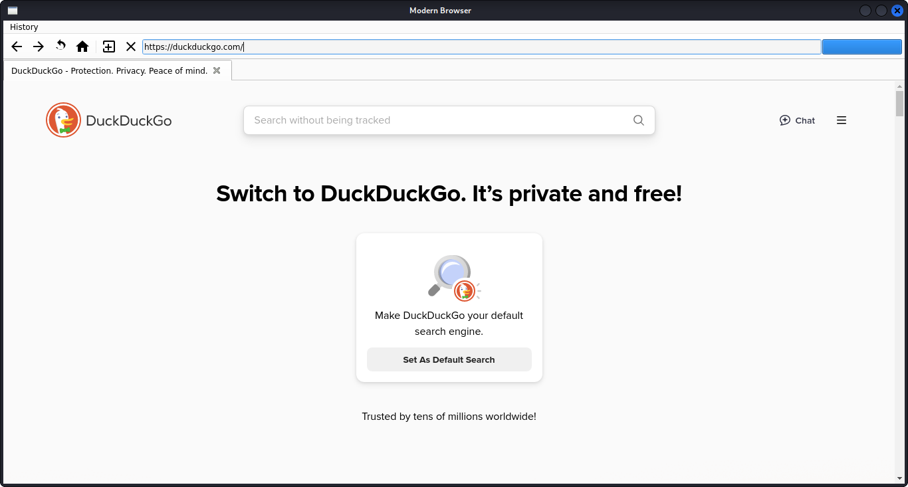
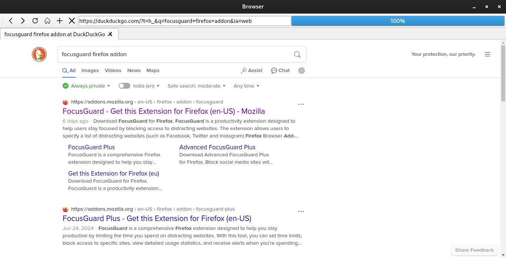
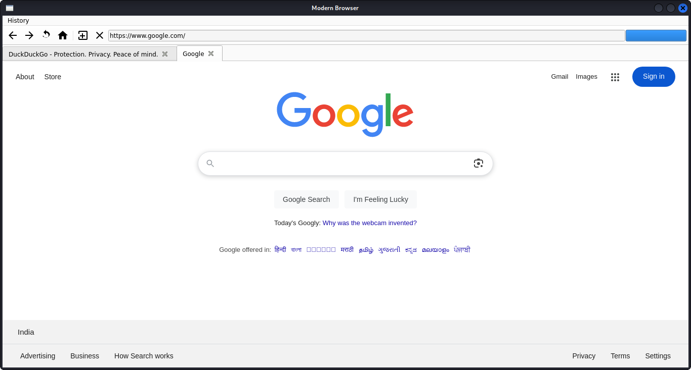

# Browser
- **browser.py**  
  Main application. Loads SVG toolbar icons from `icons/`, implements tabs, URL bar, progress bar, light Fusion theme, and History dialog.  
- **icons/**  
  Six crisp SVG icons (Back, Forward, Reload, Home, New Tab, Close Tab).  
- **requirements.txt**  
  Pinned dependencies for reproducible installs.  

---
## Screenshots

 
 
 

## ✨ Features

- **Light Fusion Theme**  
  Soft greys and crisp dark text for a modern look.  
- **Tabbed Browsing**  
  Open, close, and switch between multiple tabs.  
- **Toolbar Controls**  
  Back, Forward, Reload, Home, New Tab, and Close Tab buttons—each with SVG icons.  
- **URL / Search Bar**  
  Enter full URLs or search queries (defaults to `https://duckduckgo.com`).  
- **Progress Bar**  
  Shows page‑load progress in the toolbar.  
- **History Dialog**  
  View all visited URLs in a modal dialog.  
  - **Double‑click** an entry to jump back to that page.  
  - **Clear History** button to wipe your browsing record.  

---

## 🛠 Installation

1. **Clone the repo**  
```bash
git clone https://github.com/MysteriousImmature/ZenShield_Browser.git
cd ZenShield_Browser
  ```

2. Create & activate a virtual environment (optional but recommended)
```
python3 -m venv venv
source venv/bin/activate   # macOS/Linux
venv\Scripts\activate      # Windows
```
3. Install dependencies
```
pip install -r requirements.txt
```

## 🚀 Running the Browser
```
python browser.py
```

## 🎮 Usage
- Back / Forward: Navigate your browsing history in the current tab.
- Reload: Refresh the current page.
- Home: Jump to https://duckduckgo.com.
- New Tab: Open a blank DuckDuckGo tab.
- Close Tab: Close the current tab (minimum one tab remains).
- URL/Search Bar:
- Paste/type a full URL (e.g. https://example.com) and press Enter.
- Type any text and press Enter to search on DuckDuckGo.
- Progress Indicator: Displays page load percentage.
- History → Show History:
- Opens a dialog with your visited URLs.
- Double‑click an entry to navigate back.
- Clear History to delete all entries.

## 📦 requirements.txt
```
PyQt5==5.15.11
PyQt5-Qt5==5.15.16
PyQt5-sip==12.17.0
PyQtWebEngine==5.15.7
PyQtWebEngine-Qt5==5.15.16
```

## 🤝 Contributing
Contributions, issues and feature requests are welcome!
Feel free to open a PR or file an issue on GitHub.

