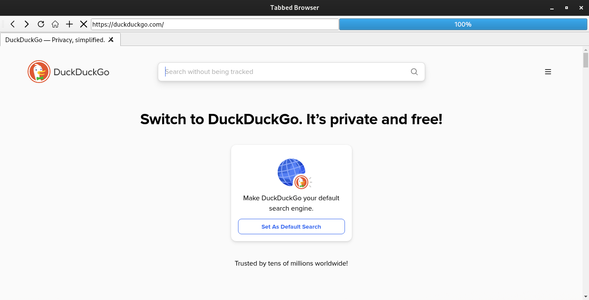

# My Cool Browser

A simple web browser built with Python and PyQt5 that uses DuckDuckGo as the default search engine. This browser supports basic functionalities like back, forward, reload, stop, home navigation, and a URL search bar with DuckDuckGo integration.

## Features

- **Default Homepage**: DuckDuckGo
- **Basic Navigation**: Back, Forward, Reload, Stop, and Home buttons
- **Search Bar**: Enter URLs or search queries directly
- **Progress Bar**: Displays loading progress

## Screenshots

 

## Installation

### Prerequisites

- Python 3.x
- `pip` (Python package installer)

### Dependencies

Install the required dependencies using `pip`:

```bash
pip install PyQt5 PyQtWebEngine
 ```

### Run the Application
Clone the repository and run the browser:

```bash
git clone https://github.com/yourusername/my-cool-browser.git
cd Basic-Browser
python browser.py
```

## Usage
- Back Button: Navigate to the previous page.
- Forward Button: Navigate to the next page.
- Reload Button: Reload the current page.
- Stop Button: Stop loading the current page.
- Home Button: Navigate to the default homepage (DuckDuckGo).
- URL/Search Bar: Enter a URL to navigate to, or enter a search query to search with DuckDuckGo.

### Contribution
We welcome contributions !